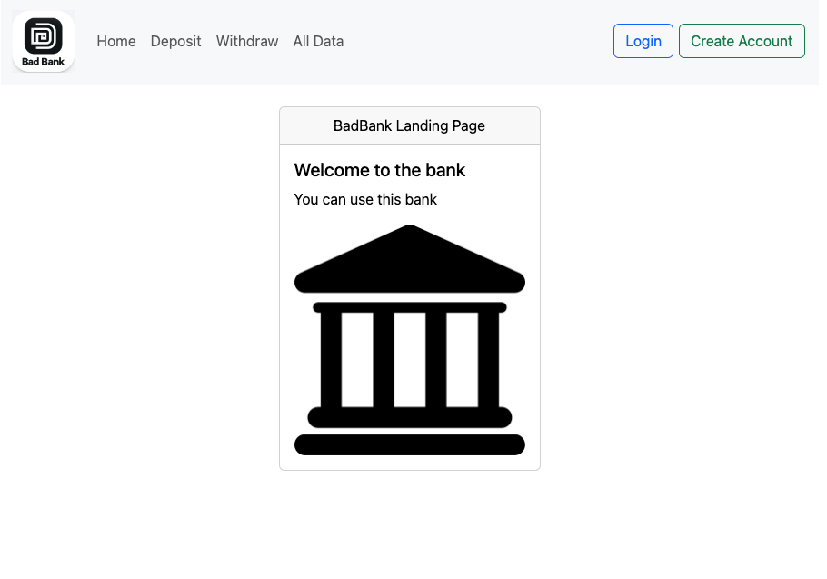
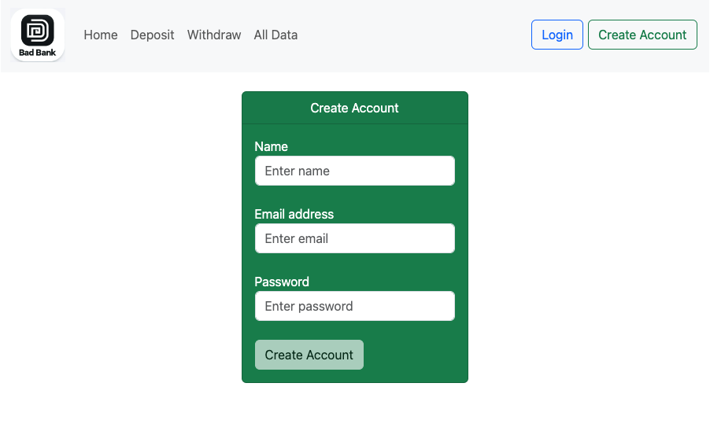

# Not So Bad Bank App

## Description/Motivation
The Bad Bank App is designed to simulate a banking application where users can perform basic banking operations like creating an account, depositing money, and withdrawing money. This project is built to help understand and implement a full-stack application using modern web technologies. It is aimed at developers and learners who wish to gain practical experience in building and deploying a web application with a back-end and front-end separation.

## Installation Guidelines
Follow these steps to set up the project locally:

### 1. Clone the repository:
```
git clone https://github.com/nerpassevera/bad-bank-app.git
cd bad-bank-app
```
### 2. Install back-end dependencies:
```
cd server
npm install
```
### 3. Install front-end dependencies:

```
cd ../client
npm install
```
### 4. Run the back-end server:
```
cd ../server
node index.js
```
### 5. Run the front-end development server:
```
cd ../client
npm start
```
### 6. Open the application:
Open your browser and go to http://localhost:3000.

## Screenshots

Home Page of the Bad Bank App  



Create Account Page  



Deposit Money Page  


## Technology Used

### Front-end:
* React
* Bootstrap

### Back-end:
* Node.js
* Express
* MongoDB

### Deployment:

* AWS S3 (for hosting static files)
* Docker (for containerization)
* Docker Compose (for managing multi-container applications)

## Features
* __Create Account__: Users can create a new account by providing basic details.
* __Deposit__: Users can deposit money into their account.
* __Withdraw__: Users can withdraw money from their account.
* __Balance__: Users can check their current account balance.

## Future Features
* __Transaction History__: View a history of all transactions made.
* __Authentication__: Secure login and registration.
* __Notifications__: Email notifications for transactions.
* __Account Management__: Edit account details and preferences.

## License
This project is licensed under the [MIT License](./license). 